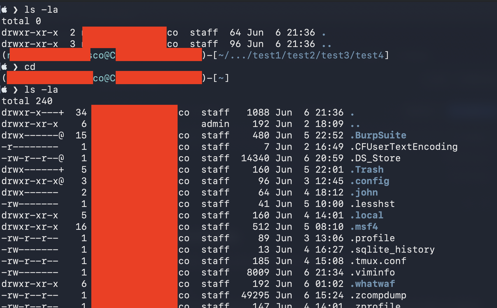
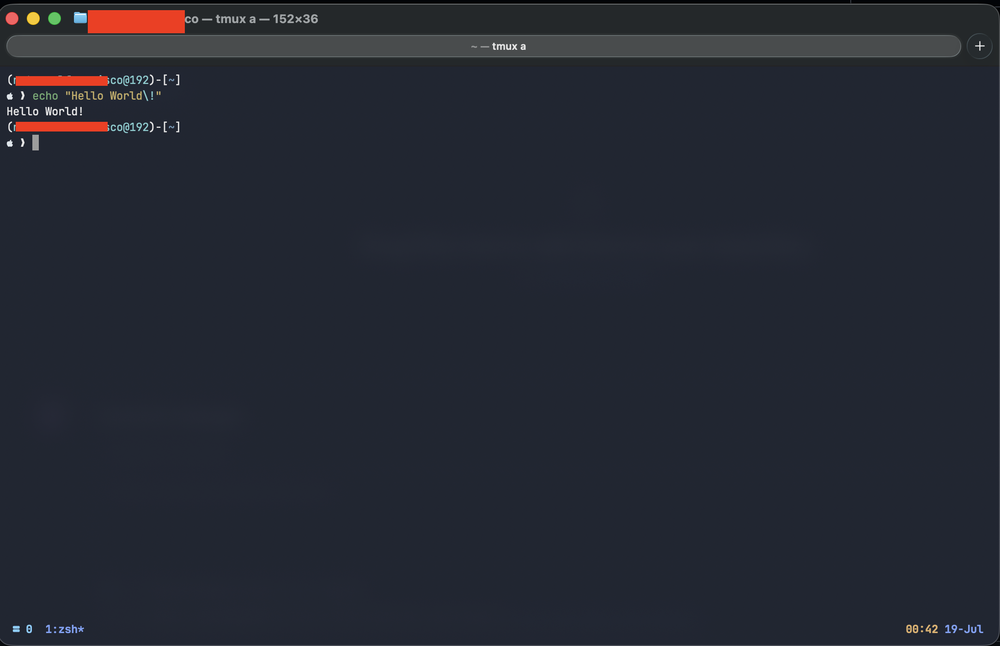
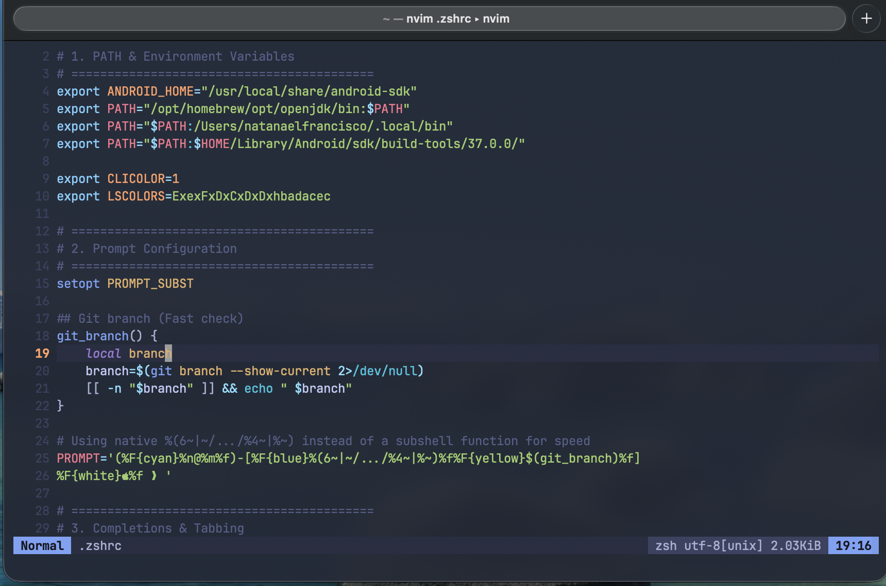

# Dotfiles Setup

These are the profile I use for my Mac setup which consists of .zshrc (ZSH profile), .tmux.conf (TMUX configuration), and nvim (kickstart.nvim)

> [!IMPORTANT]
> This is a Mac setup, the settings and configuration might differ from LINUX.

## Minimal ZSH Profile

This a minimal ZSH profile inspired by the Kali Linux terminal. Which has features such as:
1. Autosuggestion
2. Directory Selection
3. Personalized prompt showing username and hostname as well as directory (I made this on my Mac so I add the OS fitting icon)
4. Colorized folder as indicator differentiate between file and folder
5. Show current path (PWD) as well as shortening it if it's too deep

### Autosuggestion

For autosuggestion, you need to install a plugin:

> Download the plugin
```
git clone https://github.com/zsh-users/zsh-autosuggestions \
  ~/.zsh/zsh-autosuggestions
```

### Syntax Highlighting
```
git clone https://github.com/zsh-users/zsh-syntax-highlighting.git \
  ~/.zsh/zsh-syntax-highlighting
```



## TMUX Configuration

After downloading the `.tmux.conf`, you can install the plugins with `Prefix (Ctrl+b) + I (Shift + i)` and just wait for the text that says "TMUX environment reloaded.". The additions done are:
1. `tmux-resurrect` plugin to save and restore a tmux server backup in case of you computer crashing and shutting down.
2. `tmux-continuum` plugin automation for `tmux-resurrect`.
3. Switch pane my clicking.
4. A theme to match my `.zshrc`.
5. Keep current directory when splitting panes.
6. Copy selection to Mac clipboard.
7. Start windows at pane 1 not 0 (For easier switching).
8. And more...



## NVIM Configuration

My setup usually uses Neovim as my daily coding environment or IDE. My neovim profile is the [kickstart.nvim](https://github.com/nvim-lua/kickstart.nvim.git). Once you put the `nvim` folder to your machine, it will start an installation of entering `nvim`. Some changes I made to the original version are:
1. A quick navigation when splitting neovim instances, it allows for easy switching between splitted instances using `Ctrl+h\j\k\l` (Similar to moving the cursor around in vim).
2. Slightly modified default theme to match my terminal theme.


